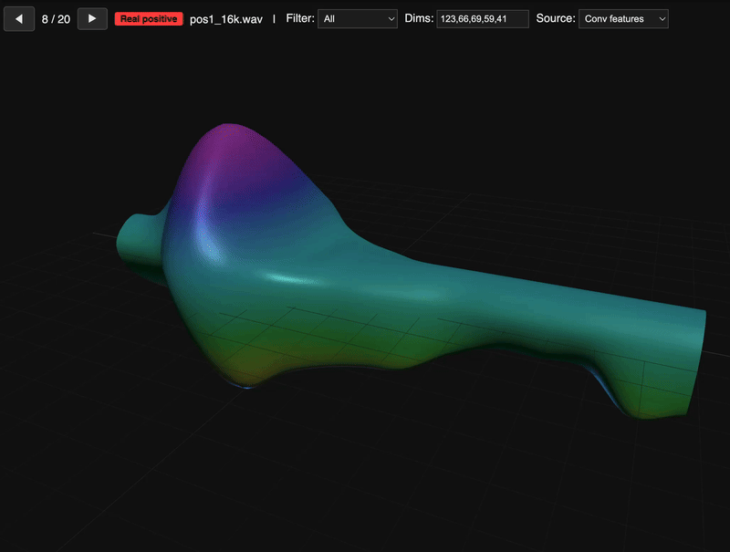

# Hotword

Custom wake word detection. Like "Hey Google" or "Hey Siri" — but yours.

Record your wake phrase, train in under 2 minutes, deploy. No cloud, no subscription, runs on-device.

<p align="center">
  
  <br>
  <em>Your wake word, visualized in 3D</em>
</p>

## Better than Porcupine. Better than OpenWakeWord.

F1=1.000. Zero false positives, 100% recall. Trains in 90 seconds on a laptop. No license fees, no cloud, no per-device limits.

## How it works

1. **Record** your wake phrase (~1s clips)
2. **Embed** using a speech embedding model (16 temporal frames x 96 dims)
3. **Train** a lightweight ConvAttn classifier (~130K params) with attention pooling
4. **Detect** in real-time with edge-based triggering (no duplicate fires)

The classifier learns temporal patterns in the embedding space — it knows *when* each part of your phrase should appear, not just *that* speech is present.

## Quick start

```bash
# Record positive samples (say your wake phrase)
make record-pos

# Record negative samples (say other things)
make record-neg

# Embed and train
make embed
make train

# Evaluate
make eval

# Run live detection
make detect
```

## Architecture

```
audio → mel spectrogram → speech embedding (ONNX) → [16 × 96]
  → Conv1D (temporal features) → attention pooling → sigmoid → wake/not-wake
```

Edge-based detection: fires once per utterance, re-arms when confidence drops. No duplicate triggers, no cooldown hacks.
